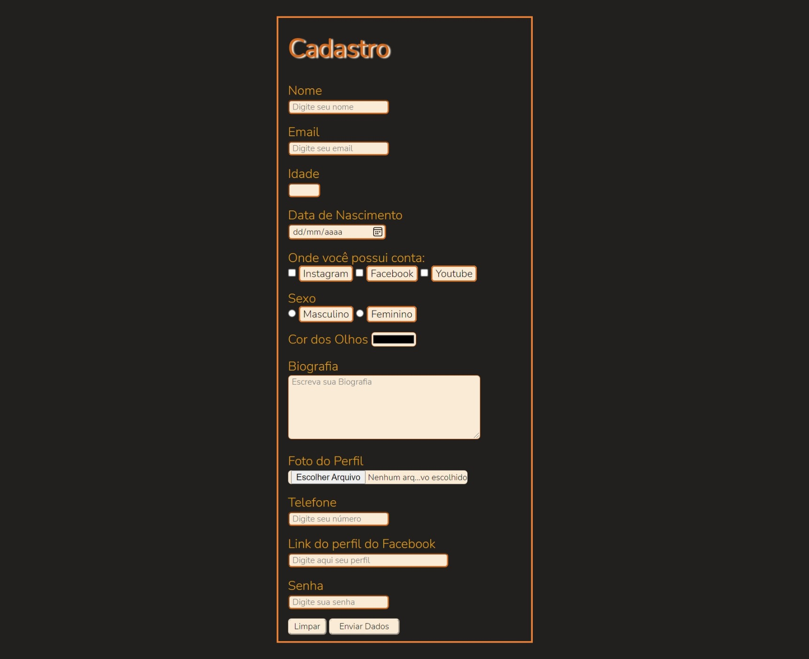

# Registration Form

> Result of the Registration Form project.

### 💻 Technologies used

In this project, input fields and CSS styling were explored a lot.
The main objective was to use many of the input variables and leave them
visually pleasing.
The reset and submit buttons were also well styled. 
<b>In this project, the following were used:</b>    
<code></code><b>70%</b>  
<code></code><b>30%</b>

### 🚀 Adjustments and improvements

The project is still under development and future updates will focus on the following tasks:

- [x] HTML update
- [x] CSS update
- [x] Layout update
- [ ] New Background
- [ ] New fields to add

## 🤝 Contributors

We thank the following people who contributed to this project:

<table>
  <tr>
    <td align="center">
      <a href="https://github.com/Guartieri" target="_blank">
         
        
          <b>Vinícius Guartieri</b>
        
      </a>
    </td>
    
  </tr>
</table>

